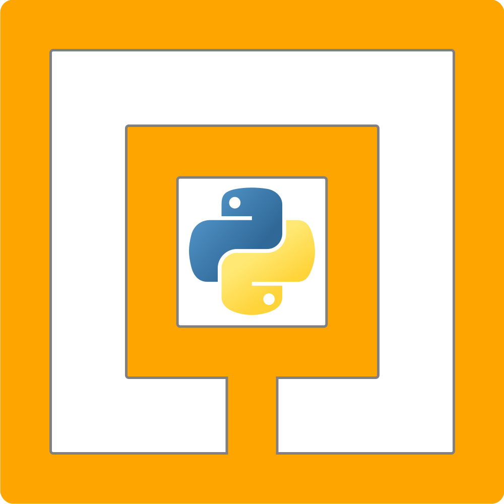

# 

NXT-Python is a package for controlling a LEGO NXT robot using the Python
programming language. It can communicate using either USB or Bluetooth.

NXT-Python for Python 2 is no longer supported.

NXT-Python repository is on [Github][] with a mirror on [sourcehut][].

[Github]: https://github.com/schodet/nxt-python "NXT-Python repository on Github"
[sourcehut]: https://sr.ht/~ni/nxt-python/ "NXT-Python repository on sourcehut"

## Requirements

- [Python 3.x](http://www.python.org)
- USB communication:
    - [PyUSB](https://github.com/pyusb/pyusb)
- Bluetooth communication:
    - [PyBluez](https://github.com/pybluez/pybluez)

## Installation

Install NXT-Python with pip:

    python3 -m pip install --upgrade nxt-python

See [installation][] instructions in the documentation for more informations.

[installation]: https://ni.srht.site/nxt-python/latest/installation.html

## Next steps

You can read the [documentation][], or start directly with the [tutorial][].

[documentation]: https://ni.srht.site/nxt-python/latest/
[tutorial]: https://ni.srht.site/nxt-python/latest/handbook/tutorial.html

## Upgrading your code

If you used previous version of NXT-Python with Python 2, the documentation
includes an [migration guide][].

[migration guide]: https://ni.srht.site/nxt-python/latest/migration.html

## Contact

There is a [mailing list][] for questions.

NXT-Python repository maintainer is Nicolas Schodet, since 2021-11-06. You can
contact him on the mailing list.

You can use the [Github issues page][] to report problems, but please use the
mailing list for questions.

[mailing list]: https://lists.sr.ht/~ni/nxt-python
[Github issues page]: https://github.com/schodet/nxt-python/issues

## Thanks

- Doug Lau for writing NXT\_Python, our starting point.
- rhn for creating what would become v2, making lots of smaller changes, and
  reviewing tons of code.
- Marcus Wanner for maintaining NXT-Python up to v2.2.2, his work has been
  amazing!
- Elvin Luff for taking over the project after Marcus, making a lot of work
  for the port to Python 3.
- mindsensors.com (esp. Ryan Kneip) for helping out with the code for a lot of
  their sensors, expanding the sensors covered by the type checking database,
  and providing hardware for testing.
- HiTechnic for providing identification information for their sensors. I note
  that they have now included this information in their website. ;)
- Linus Atorf, Samuel Leeman-Munk, melducky, Simon Levy, Steve Castellotti,
  Paulo Vieira, zonedabone, migpics, TC Wan, jerradgenson, henryacev, Paul
  Hollensen, and anyone else I forgot for various fixes and additions.
- Goldsloth for making some useful changes and keeping the tickets moving
  after the migration to Github.
- All our users for their interest and support!

## License

NXT-Python is free software: you can redistribute it and/or modify it under
the terms of the GNU General Public License as published by the Free Software
Foundation, either version 3 of the License, or (at your option) any later
version.

This program is distributed in the hope that it will be useful, but WITHOUT
ANY WARRANTY; without even the implied warranty of MERCHANTABILITY or FITNESS
FOR A PARTICULAR PURPOSE. See the GNU General Public License for more details.

You should have received a copy of the GNU General Public License along with
this program. If not, see <http://www.gnu.org/licenses/>.
